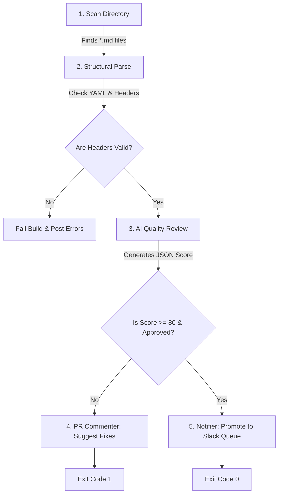

# How It Works: Patent Disclosure Linter Pipeline

This document provides a detailed walkthrough of the technical pipeline that parses, scores, reviews, and notifies the team about incoming patent disclosures.

---

## 🛠️ The Pipeline Architecture

The linter goes through five distinct phases to evaluate an innovation blueprint:

---

## 🔍 Detailed Phase Breakdown

### Phase 1: File Discovery
* **Entry Point**: The orchestrator in [src/index.js](file:///c:/Users/Jeff/OneDrive%20-%20Hoververse/Antigravity%20Apps/patent-disclosure-linter/src/index.js) scans the designated target directory (e.g. `./disclosures`).
* **Filtering**: The `findMarkdownFiles` function searches recursively for markdown (`.md`) files but explicitly ignores:
  - The `templates/` directory (to avoid linting template structures).
  - The `node_modules/` and `.git/` folders.
  - The `README.md` and `HOW-IT-WORKS.md` files themselves.

### Phase 2: Structural & Frontmatter Parse
Before wasting LLM tokens on low-quality files, the linter performs local structural checks in [src/linter.js](file:///c:/Users/Jeff/OneDrive%20-%20Hoververse/Antigravity%20Apps/patent-disclosure-linter/src/linter.js):
1. **Frontmatter Extraction**: Uses regex to split the YAML block between `---` markers.
2. **Metadata Presence**: Parses YAML and validates that `title`, `lead_inventor`, `project_context`, and `status` are filled out and do not contain placeholder bracket tags like `[Name]`.
3. **Markdown Section Check**: Scans the body text to confirm that the four required sections are present (Problem, Solution, Evidence, and Unique).

### Phase 3: AI Quality Review
If structural checks pass, the linter constructs a prompt including the blueprint content and a detailed list of instructions (System Prompts).
* **AI Evaluation**: The linter calls `AiClient` in [src/ai-client.js](file:///c:/Users/Jeff/OneDrive%20-%20Hoververse/Antigravity%20Apps/patent-disclosure-linter/src/ai-client.js).
* **Portability**: The client requests standard JSON output. The client can easily swap endpoints (Gemini, OpenAI, or a private enterprise proxy) via variables.
* **Strict Evaluation Vectors**: The model verifies:
  - **Unexpected Results**: Checks for quantifiable data (e.g., performance % gains) instead of vague text.
  - **Work-Around Test**: Evaluates whether competitor cloning obstacles are addressed.
  - **Prior Art Context**: Ensures standard packages/methods replaced are specified.
  - **Component Modularity**: Confirms the Method (algorithm/process steps) is separated from the Device (physical hardware/sensors).

### Phase 4: Feedback Loop (Pull Requests)
If the action detects that it is running within a GitHub Pull Request context (using `GITHUB_EVENT_NAME === 'pull_request'`):
* It calls [src/github-commenter.js](file:///c:/Users/Jeff/OneDrive%20-%20Hoververse/Antigravity%20Apps/patent-disclosure-linter/src/github-commenter.js).
* It builds a rich markdown message with a Status Table and GitHub Alerts (e.g., `> [!WARNING]`, `> [!NOTE]`).
* If failures exist, it writes the recommendations inline on the PR, helping the developer modify their markdown directly.
* It writes a summary report directly into the GitHub **Job Step Summary** page.

### Phase 5: Notification & Promotion Gate
When a disclosure successfully scores **80 or higher** and is marked as **APPROVED** by the AI model:
* [src/notifier.js](file:///c:/Users/Jeff/OneDrive%20-%20Hoververse/Antigravity%20Apps/patent-disclosure-linter/src/notifier.js) triggers.
* It constructs a Slack Block Kit payload containing the metadata details, score, and linter review comments.
* It sends a `POST` request to the configured `DISCLOSURE_WEBHOOK_URL` to notify the Patent Review Committee.
* If any check failed, the action exits with code `1`, causing the GitHub PR merge checks to fail.
